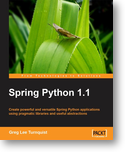

Overview
========

Spring Python intends to take the concepts that were developed, tested, and
proven with the Spring Framework, and carry them over to the language of Python.
If anyone has developed a solution using multiple technologies including Java,
C#/.NET, and Python, they will realize that certain issues exist in all these
platforms.

This is not a direct port of existing source code, but rather, a port of proven
solutions, while still remaining faithful to the style, idioms, and overall
user community of Python.

.. note::

  *Spring Python is an offshoot of the Java-based Spring Framework and Spring
  Security Framework, targeted for Python. Spring provides many useful features,
  and I wanted those same features available when working with Python.*

  --Greg Turnquist, Spring Python project lead

Key Features
++++++++++++

The following features have been implemented:

* :doc:`Inversion Of Control <objects>` - The idea is to decouple two classes
  at the interface level. This lets you build many reusable parts in your
  software, and your whole application becomes more pluggable. You can use
  PythonConfig, YamlConfig or XMLConfig to plugin your object
  definition to an ApplicationContext.

* :doc:`Aspect Oriented Programming <aop>` - Spring Python provides great ways
  to wrap advice around objects. It is utilized for remoting. Another use is for
  debug tracers and performance tracing.

* :doc:`DatabaseTemplate <dao>` - Reading from the database requires a
  monotonous cycle of opening cursors, reading rows, and closing cursors, along
  with exception handlers. With this template class, all you need is the SQL query
  and row-handling function. Spring Python does the rest.

* :doc:`Database Transactions <transaction>` - Wrapping multiple database calls
  with transactions can make your code hard to read. This module provides multiple
  ways to define transactions without making things complicated.

* :doc:`Security <security>` - Plugin security interceptors to lock down access
  to your methods, utilizing both authentication and domain authorization.

* :doc:`Remoting <remoting>` - It is easy to convert your local application
  into a distributed one. If you have already built your client and server pieces
  using the IoC container, then going from local to distributed is just a
  configuration change.

* :doc:`JMS Messaging <jms>` - Connect to Java or Python applications using
  queueing middleware. Spring Python can act as a standalone client of a JMS
  provider with no Java EE infrastructure needed on Python side.

* :doc:`Plug-ins/command-line tool <plugins>` - Use the plugin system designed
  to help you rapidly develop applications.

* :doc:`Samples <samples>` - to help demonstrate various features of Spring
  Python, some sample applications have been created:

  * PetClinic - Everybody's favorite Spring sample application has been rebuilt
    from the ground up using various web containers including: CherryPy. Go
    check it out for an example of how to use this framework.

  * Spring Wiki - Wikis are powerful ways to store and manage content, so we
    created a simple one as a demo!

  * Spring Bot - Use Spring Python to build a tiny bot to manage the IRC channel
    of your open source project.

What Spring Python is NOT
+++++++++++++++++++++++++

Spring Python is NOT another web framework. I think there are plenty that are
fine to use, like Django, TurboGears, Zope, CherryPy, Quixote, and more.
Spring Python is meant to provide utilities to support any python application,
including a web-based one.

So far, the demos have been based on CherryPy, but the idea is that these
features should work with any python web framework. The Spring Python team is
striving to make things reusable with any python-based web framework. There
is always the goal of expanding the samples into other frameworks, whether
they are web-based, `RIA <http://en.wikipedia.org/wiki/Rich_Internet_application>`_, or thick-client.

Support
+++++++

Spring Python 1.1 book
----------------------

You can order either a printed or electronic version of the
`Spring Python 1.1 book <https://www.packtpub.com/create-powerful-versatile-spring-python-1-1-applications/book>`_
written by project creator Greg Turnquist. This contains a lot of code
samples, diagrams, and descriptions of the concepts behind Spring Python. This
book was completed right as Spring Python 1.1 was released, and 1.2.x was
started, so it contains up-to-date information on the project.

Forums and Email
----------------

* You can read the messages on `Spring Python's forums <http://forum.springsource.org/forumdisplay.php?f=45>`_
  at the official Spring forum site.

* If you are interested, you can sign up for the
  `springpython-developer mailing list <http://lists.springsource.com/listmanager/listinfo/springpython-users>`_.

* You can read the
  `current archives of the spring-users mailing list <http://lists.springsource.com/archives/springpython-users/>`_.

* You can also read the
  `old archives of the retired spring-developer mailing list <http://sourceforge.net/mailarchive/forum.php?forum=springpython-developer>`_.

* If you want to join this project, see :ref:`how to become a team member <how-to-become-a-team-member>`

IRC
---

Join us on the #springpython IRC channel at `Freenode <http://freenode.net>`_.

Downloads / Source Code
+++++++++++++++++++++++

If you want a release, check out
`Spring's download site for Spring Python <http://www.springsource.com/download/community?project=Spring%20Python>`_.

Spring Python has migrated to `git <http://book.git-scm.com/index.html>`_, the distributed version control system.
If you want the latest source code type::

  git clone git://git.springsource.org/spring-python/spring-python.git

That will create a new spring-python folder containing the entire repository.
This includes both the source code and the demo applications (PetClinic and
SpringWiki). You will be on the master branch. From there, you can switch
to various branches the team is working on, or create your own branch to
experiment and develop patches.

You can browse the code at https://fisheye.springsource.org/browse/se-springpython-py.

Licensing
+++++++++

Spring Python is released under the
`Apache Server License 2.0 <http://www.apache.org/licenses/LICENSE-2.0>`_
and the copyright is held by SpringSource.

Spring Python's team
++++++++++++++++++++

Spring Python's official team (those with committer rights):

* Project Lead: Greg L. Turnquist
* Project Contributor: Dariusz Suchojad
* Project Contributor: Sven Wilhelm

Many others have also contributed through reporting issues, raising questions,
and even sending patches.

.. _how-to-become-a-team-member:

How to become a team member
---------------------------

We like hearing about new people interesting in joining the project. We are
also excited in hearing from people interested in working on a particular
jira feature.

The way we do things around here, we like to work through a few patches before
granting you any committer rights. You can checkout a copy of the code
anonymously, and then work on your patch. Email your patch to one of the
official team members, and we will inspect things. From there we will consider
committing your patch, or send you feedback.

Before sending us a patch, we ask you to sign the
`SpringSource Individual Contributor Agreement <https://support.springsource.com/spring_committer_signup>`_.

After a few patches, if things are looking good, we may evaluate giving you
committer rights.

Spring Python is a `TDD-based <http://en.wikipedia.org/wiki/Test-driven_development>`_
project, meaning if you are working on code,
be sure to write an automated test case and write the test case FIRST. For
insight into that, take a trip into the code repository's test section to
see how current things are run. Your patch can get sold off and committed
much faster if you include automated test cases and a pasted sample of your
test case running successfully along with the rest of the baseline test suite.

You don't have to become a team member to contribute to this project, but if
you want to contribute code, then we ask that you follow the details of this
process, because this project is focused on high quality code, and we want to
hold everyone to the same standard.

.. rubric:: Getting started with contributing

#. First of all, I suggest you sign up on our
   `springpython-developer <http://lists.springsource.com/listmanager/listinfo/springpython-users>`_
   mailing list. That way, you'll get notified about big items as well be on the inside
   for important developments that may or may not get published to the web site.
   *NOTE: Use the springsource list, NOT the sourceforge one.*

#. Second, I suggest you register for a `jira account <http://jira.springsource.org/>`_,
   so you can leave comments, etc. on the ticket. I think that works (I don't manage
   jira, so if it doesn't let me know, and we will work from there) NOTE: I like
   notes and comments tracking what you have done, or what you think needs to be done.
   It gives us input in case someone else eventually has to complete the ticket.
   That would also be the place where you can append new files or patches to existing code.

#. Third, register at the `SpringSource community forum <http://forum.springsource.org/>`_,
   and if you want to kick ideas around or float a concept, feel free to start a thread in our Spring
   Python forum.

#. Finally, we really like to have supporting documentation as well as code.
   That helps other people who aren't as up-to-speed on your piece of the
   system. Go ahead and start your patch, but don't forget to look into the
   docs folder and update or add to relevant documentation. Our documentation
   is part of the source code, so you can submit doc mods as patches also.
   Include information such as dependencies, design notes, and whatever else
   you think would be valuable.

With all that said, happy coding!

Deprecated Code
+++++++++++++++

To keep things up-to-date, we need to deprecate code from time to time.
Python has built in functionality to put warnings into certain sections of
code, so that if you import a deprecated module, you will be properly warned.
With each major release (1.0, 2.0, 3.0, etc.), the Spring Python team has the
option to remove any and all deprecated code.