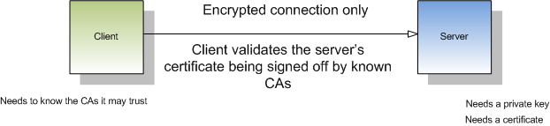
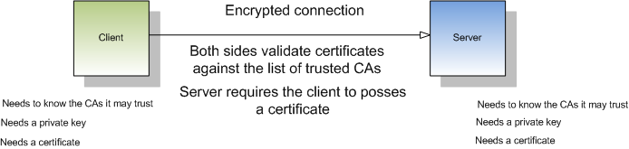
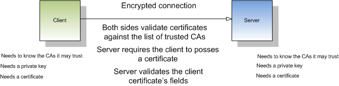
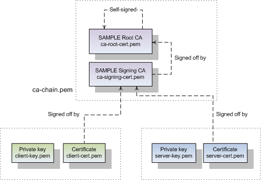

Remoting
========

Coupling Aspect Oriented Programming with different types of Python remoting
services makes it easy to convert your local application into a distributed
one. Technically, the remoting segment of Spring Python doesn't use AOP.
However, it is very similar in the concept that you won't have to modify either
your servers or your clients.

Distributed applications have multiple objects. These can be spread across
different instances of the Python interpreter on the same machine, as well
on different machines on the network. The key factor is that they need to talk
to each other. The developer shouldn't have to spend a large effort coding a
custom solution. Another common practice in the realm of distributed programming
is that fact that programmers often develop standalone. When it comes time to
distribute the application to production, the configuration may be very
different. Spring Python solves this by making the link between client and
server objects a step of configuration not coding.

In the context of this section of documentation, the term client refers to
a client-application that is trying to access some remote service. The service
is referred to as the server object. The term remote is subjective. It can
either mean a different thread, a different interpretor, or the other side
of the world over an Internet connection. As long as both parties agree on
the configuration, they all share the same solution.

External dependencies
---------------------

Spring Python currently supports and requires the installation of at least one of the libraries:

* `Pyro <http://pyro.sourceforge.net/>`_ (Python Remote Objects) - a pure Python transport mechanism

* `Hessian <http://hessian.caucho.com/>`_ - support for Hessian has just started. So far, you can call
  Python-to-Java based on libraries released from Caucho.

Remoting with PYRO (Python Remote Objects)
------------------------------------------

Decoupling a simple service, to setup for remoting
++++++++++++++++++++++++++++++++++++++++++++++++++

For starters, let's define a simple service::

  class Service(object):
      def get_data(self, param):
          return "You got remote data => %s" % param

Now, we will create it locally and then call it::

  service = Service()
  print service.get_data("Hello")

  "You got remote data => Hello"

.. highlight:: xml

Okay, imagine that you want to relocate this service to another instance of
Python, or perhaps another machine on your network. To make this easy, let's
utilize Inversion Of Control, and transform this service into a Spring service.
First, we need to define an application context. We will create a file called
*applicationContext.xml*::

  <?xml version="1.0" encoding="UTF-8"?>
  <objects xmlns="http://www.springframework.org/springpython/schema/objects/1.1"
         xmlns:xsi="http://www.w3.org/2001/XMLSchema-instance"
         xsi:schemaLocation="http://www.springframework.org/springpython/schema/objects/1.1
                 http://springpython.webfactional.com/schema/context/spring-python-context-1.1.xsd">

      <object id="service" class="Service"/>

  </objects>

.. highlight:: python

The client code is changed to this::

  appContext = ApplicationContext(XMLConfig("applicationContext.xml"))
  service = appContext.get_object("service")
  print service.get_data("Hello")

  "You got remote data => Hello"

Not too tough, ehh? Well, guess what. That little step just decoupled the
client from directly creating the service. Now we can step in and configure
things for remote procedure calls without the client knowing it.

Exporting a Spring Service Using :doc:`Inversion Of Control <objects>`
++++++++++++++++++++++++++++++++++++++++++++++++++++++++++++++++++++++

.. highlight:: xml

In order to reach our service remotely, we have to export it. Spring Python
provides *PyroServiceExporter* to export your service through Pyro. Add this
to your application context::

  <?xml version="1.0" encoding="UTF-8"?>
  <objects xmlns="http://www.springframework.org/springpython/schema/objects/1.1"
         xmlns:xsi="http://www.w3.org/2001/XMLSchema-instance"
         xsi:schemaLocation="http://www.springframework.org/springpython/schema/objects/1.1
                 http://springpython.webfactional.com/schema/context/spring-python-context-1.1.xsd">

      <object id="remoteService" class="Service"/>

      <object id="service_exporter" class="springpython.remoting.pyro.PyroServiceExporter">
          <property name="service_name" value="ServiceName"/>
          <property name="service" ref="remoteService"/>
      </object>

      <object id="service" class="springpython.remoting.pyro.PyroProxyFactory">
          <property name="service_url" value="PYROLOC://localhost:7766/ServiceName"/>
      </object>

  </objects>

Three things have happened:

* Our original service's object name has been changed to *remoteService*.

* Another object was introduced called *service_exporter*. It references object
  *remoteService*, and provides a proxied interface through a Pyro URL.

* We created a client called *service*. That is the same name our client code it
  looking for. It won't know the difference!

Hostname/Port overrides
>>>>>>>>>>>>>>>>>>>>>>>

Pyro defaults to advertising the service at *localhost:7766*. However, you can
easily override that by setting the *service_host* and *service_port* properties
of the *PyroServiceExporter* object, either through setter
or :ref:`constructor injection <objects-xmlconfig-constructors>`::

  <?xml version="1.0" encoding="UTF-8"?>
  <objects xmlns="http://www.springframework.org/springpython/schema/objects/1.1"
         xmlns:xsi="http://www.w3.org/2001/XMLSchema-instance"
         xsi:schemaLocation="http://www.springframework.org/springpython/schema/objects/1.1
                 http://springpython.webfactional.com/schema/context/spring-python-context-1.1.xsd">

      <object id="remoteService" class="Service"/>

      <object id="service_exporter" class="springpython.remoting.pyro.PyroServiceExporter">
          <property name="service_name" value="ServiceName"/>
          <property name="service" ref="remoteService"/>
          <property name="service_host" value="127.0.0.1"/>
          <property name="service_port" value="7000"/>
      </object>

      <object id="service" class="springpython.remoting.pyro.PyroProxyFactory">
          <property name="service_url" value="PYROLOC://127.0.0.1:7000/ServiceName"/>
      </object>

  </objects>

In this variation, your service is being hosted on port 7000 instead of the
default 7766. This is also key, if you need to advertise to another IP address,
to make it visible to another host.

Now when the client runs, it will fetch the *PyroProxyFactory*, which will use
Pyro to look up the exported module, and end up calling our remote Spring
service. And notice how neither our service nor the client have changed!

.. note::

  Python doesn't need an interface declaration for the client proxy

  If you have used Spring Java's remoting client proxy beans, then you may be
  used to the idiom of specifying the interface of the client proxy. Due to
  Python's dynamic nature, you don't have to do this.

We can now split up this application into two objects. Running the remote
service on another server only requires us to edit the client's application
context, changing the URL to get to the service. All without telling the
client and server code.

Do I have to use XML?
+++++++++++++++++++++

No. Again, Spring Python provides you the freedom to do things using the
IoC container, or programmatically.

.. highlight:: python

To do the same configuration as shown above looks like this::

  from springpython.remoting.pyro import PyroServiceExporter
  from springpython.remoting.pyro import PyroProxyFactory

  # Create the service
  remoteService = Service()

  # Export it via Pyro using Spring Python's utility classes
  service_exporter = PyroServiceExporter()
  service_exporter.service_name = "ServiceName"
  service_exporter.service = remoteService
  service_exporter.after_properties_set()

  # Get a handle on a client-side proxy that will remotely call the service.
  service = PyroProxyFactory()
  service.service_url = "PYROLOC://127.0.0.1:7000/ServiceName"

  # Call the service just you did in the original, simplified version.
  print service.get_data("Hello")

Against, you can override the hostname/port values as well::

  # ...
  # Export it via Pyro using Spring Python's utility classes
  service_exporter = PyroServiceExporter()
  service_exporter.service_name = "ServiceName"
  service_exporter.service = remoteService
  service_exporter.service_host = "127.0.0.1" # or perhaps the machine's actual hostname
  service_exporter.service_port = 7000
  service_exporter.after_properties_set()
  # ...

That is effectively the same steps that the IoC container executes.

.. note::

  Don't forget after_properties_set!

  Since *PyroServiceExporter* is an *InitializingObject*, you must call
  *after_properties_set* in order for it to start the Pyro thread. Normally
  the IoC container will do this step for you, but if you choose to create
  the proxy yourself, you are responsible for this step.

Splitting up the client and the server
++++++++++++++++++++++++++++++++++++++

This configuration sets us up to run the server and the client in two different
Python VMs. All we have to do is split things into two parts.

.. highlight:: xml

Copy the following into *server.xml*::

  <?xml version="1.0" encoding="UTF-8"?>
  <objects xmlns="http://www.springframework.org/springpython/schema/objects/1.1"
         xmlns:xsi="http://www.w3.org/2001/XMLSchema-instance"
         xsi:schemaLocation="http://www.springframework.org/springpython/schema/objects/1.1
                 http://springpython.webfactional.com/schema/context/spring-python-context-1.1.xsd">

      <object id="remoteService" class="server.Service"/>

      <object id="service_exporter" class="springpython.remoting.pyro.PyroServiceExporter">
          <property name="service_name" value="ServiceName"/>
          <property name="service" ref="remoteService"/>
          <property name="service_host" value="127.0.0.1"/>
          <property name="service_port" value="7000"/>
      </object>

  </objects>

.. highlight:: python

Copy the following into *server.py*::

  import logging
  from springpython.config import XMLConfig
  from springpython.context import ApplicationContext

  class Service(object):
      def get_data(self, param):
          return "You got remote data => %s" % param

  if __name__ == "__main__":
      # Turn on some logging in order to see what is happening behind the scenes...
      logger = logging.getLogger("springpython")
      loggingLevel = logging.DEBUG
      logger.setLevel(loggingLevel)
      ch = logging.StreamHandler()
      ch.setLevel(loggingLevel)
      formatter = logging.Formatter("%(asctime)s - %(name)s - %(levelname)s - %(message)s")
      ch.setFormatter(formatter)
      logger.addHandler(ch)

      appContext = ApplicationContext(XMLConfig("server.xml"))

.. highlight:: xml

Copy the following into *client.xml*::

  <?xml version="1.0" encoding="UTF-8"?>
  <objects xmlns="http://www.springframework.org/springpython/schema/objects/1.1"
         xmlns:xsi="http://www.w3.org/2001/XMLSchema-instance"
         xsi:schemaLocation="http://www.springframework.org/springpython/schema/objects/1.1
                 http://springpython.webfactional.com/schema/context/spring-python-context-1.1.xsd">

      <object id="service" class="springpython.remoting.pyro.PyroProxyFactory">
          <property name="service_url" value="PYROLOC://127.0.0.1:7000/ServiceName"/>
      </object>

  </objects>

.. highlight:: python

Copy the following into *client.py*::

  import logging
  from springpython.config import XMLConfig
  from springpython.context import ApplicationContext

  if __name__ == "__main__":
      # Turn on some logging in order to see what is happening behind the scenes...
      logger = logging.getLogger("springpython")
      loggingLevel = logging.DEBUG
      logger.setLevel(loggingLevel)
      ch = logging.StreamHandler()
      ch.setLevel(loggingLevel)
      formatter = logging.Formatter("%(asctime)s - %(name)s - %(levelname)s - %(message)s")
      ch.setFormatter(formatter)
      logger.addHandler(ch)

      appContext = ApplicationContext(XMLConfig("client.xml"))
      service = appContext.get_object("service")
      print "CLIENT: %s" % service.get_data("Hello")

First, launch the server script, and then launch the client script, both on
the same machine. They should be able to talk to each other with no problem at
all, producing some log chatter like this:

::

  $ python server.py &
  [1] 20854

  2009-01-08 12:06:20,021 - springpython.container.ObjectContainer - DEBUG - === Scanning configuration <springpython.config.XMLConfig object at 0xb7fa276c> for object definitions ===
  2009-01-08 12:06:20,021 - springpython.config.XMLConfig - DEBUG - ==============================================================
  2009-01-08 12:06:20,022 - springpython.config.XMLConfig - DEBUG - * Parsing server.xml
  2009-01-08 12:06:20,025 - springpython.config.XMLConfig - DEBUG - ==============================================================
  2009-01-08 12:06:20,025 - springpython.container.ObjectContainer - DEBUG - remoteService object definition does not exist. Adding to list of definitions.
  2009-01-08 12:06:20,026 - springpython.container.ObjectContainer - DEBUG - service_exporter object definition does not exist. Adding to list of definitions.
  2009-01-08 12:06:20,026 - springpython.container.ObjectContainer - DEBUG - === Done reading object definitions. ===
  2009-01-08 12:06:20,026 - springpython.context.ApplicationContext - DEBUG - Eagerly fetching remoteService
  2009-01-08 12:06:20,026 - springpython.context.ApplicationContext - DEBUG - Did NOT find object 'remoteService' in the singleton storage.
  2009-01-08 12:06:20,026 - springpython.context.ApplicationContext - DEBUG - Creating an instance of id=remoteService props=[] scope=scope.SINGLETON factory=ReflectiveObjectFactory(server.Service)
  2009-01-08 12:06:20,026 - springpython.factory.ReflectiveObjectFactory - DEBUG - Creating an instance of server.Service
  2009-01-08 12:06:20,027 - springpython.context.ApplicationContext - DEBUG - Stored object 'remoteService' in container's singleton storage
  2009-01-08 12:06:20,027 - springpython.context.ApplicationContext - DEBUG - Eagerly fetching service_exporter
  2009-01-08 12:06:20,027 - springpython.context.ApplicationContext - DEBUG - Did NOT find object 'service_exporter' in the singleton storage.
  2009-01-08 12:06:20,027 - springpython.context.ApplicationContext - DEBUG - Creating an instance of id=service_exporter props=[<springpython.config.ValueDef object at 0xb7a4664c>, <springpython.config.ReferenceDef object at 0xb7a468ac>, <springpython.config.ValueDef object at 0xb7a4692c>, <springpython.config.ValueDef object at 0xb7a46d2c>] scope=scope.SINGLETON factory=ReflectiveObjectFactory(springpython.remoting.pyro.PyroServiceExporter)
  2009-01-08 12:06:20,028 - springpython.factory.ReflectiveObjectFactory - DEBUG - Creating an instance of springpython.remoting.pyro.PyroServiceExporter
  2009-01-08 12:06:20,028 - springpython.context.ApplicationContext - DEBUG - Stored object 'service_exporter' in container's singleton storage
  2009-01-08 12:06:20,028 - springpython.remoting.pyro.PyroServiceExporter - DEBUG - Exporting ServiceName as a Pyro service at 127.0.0.1:7000
  2009-01-08 12:06:20,029 - springpython.remoting.pyro.PyroDaemonHolder - DEBUG - Registering ServiceName at 127.0.0.1:7000 with the Pyro server
  2009-01-08 12:06:20,029 - springpython.remoting.pyro.PyroDaemonHolder - DEBUG - Pyro thread needs to be started at 127.0.0.1:7000
  2009-01-08 12:06:20,030 - springpython.remoting.pyro.PyroDaemonHolder._PyroThread - DEBUG - Starting up Pyro server thread for 127.0.0.1:7000

  $ python client.py

  2009-01-08 12:06:26,291 - springpython.container.ObjectContainer - DEBUG - === Scanning configuration <springpython.config.XMLConfig object at 0xb7ed45ac> for object definitions ===
  2009-01-08 12:06:26,292 - springpython.config.XMLConfig - DEBUG - ==============================================================
  2009-01-08 12:06:26,292 - springpython.config.XMLConfig - DEBUG - * Parsing client.xml
  2009-01-08 12:06:26,294 - springpython.config.XMLConfig - DEBUG - ==============================================================
  2009-01-08 12:06:26,294 - springpython.container.ObjectContainer - DEBUG - service object definition does not exist. Adding to list of definitions.
  2009-01-08 12:06:26,294 - springpython.container.ObjectContainer - DEBUG - === Done reading object definitions. ===
  2009-01-08 12:06:26,295 - springpython.context.ApplicationContext - DEBUG - Eagerly fetching service
  2009-01-08 12:06:26,295 - springpython.context.ApplicationContext - DEBUG - Did NOT find object 'service' in the singleton storage.
  2009-01-08 12:06:26,295 - springpython.context.ApplicationContext - DEBUG - Creating an instance of id=service props=[<springpython.config.ValueDef object at 0xb797948c>] scope=scope.SINGLETON factory=ReflectiveObjectFactory(springpython.remoting.pyro.PyroProxyFactory)
  2009-01-08 12:06:26,295 - springpython.factory.ReflectiveObjectFactory - DEBUG - Creating an instance of springpython.remoting.pyro.PyroProxyFactory
  2009-01-08 12:06:26,295 - springpython.context.ApplicationContext - DEBUG - Stored object 'service' in container's singleton storage

  CLIENT: You got remote data => Hello

This shows one instance of Python running the client, connecting to the instance
of Python hosting the server module. After that, moving these scripts to other
machines only requires changing the hostname in the XML files.

Remoting with Hessian
---------------------

.. note::

  Caucho's Python library for Hessian is incomplete

  Due to minimal functionality provided by Caucho's Hessian library for Python,
  there is minimal documentation to show its functionality.

.. highlight:: xml

The following shows how to connect a client to a Hessian-exported service.
This can theoretically be any technology. Currently, Java objects are converted
intoPpython dictionaries, meaning that the data and transferred, but there are
not method calls available::

  <?xml version="1.0" encoding="UTF-8"?>
  <objects xmlns="http://www.springframework.org/springpython/schema/objects/1.1"
         xmlns:xsi="http://www.w3.org/2001/XMLSchema-instance"
         xsi:schemaLocation="http://www.springframework.org/springpython/schema/objects/1.1
                 http://springpython.webfactional.com/schema/context/spring-python-context-1.1.xsd">

      <object id="personService" class="springpython.remoting.hessian.HessianProxyFactory">
          <property name="service_url"><value>http://localhost:8080/</value></property>
      </object>

  </objects>

The Caucho library appears to only support Python being a client, and not yet
as a service, so there is no *HessianServiceExporter* available yet.

High-Availability/Clustering Solutions
--------------------------------------

.. highlight:: python

This props you up for many options to increase availability. It is possible to
run a copy of the server on multiple machines. You could then institute some
type of round-robin router to go to different URLs. You could easily run ten
copies of the remote service::

  pool = []
  for i in range(10):
      service_exporter = PyroServiceExporter(service_name = "ServiceName%s" % i, service = Service())
      pool.append(service_exporter)

(Yeah, I know, you can probably do this in one line with a list comprehension).

Now you have ten copies of the server running, each under a distinct name.

For any client, your configuration is a slight tweak::

  services = []
  for i in range(10):
      services.append(PyroProxyFactory(service_url = "PYROLOC://localhost:7766/ServiceName%s" % i))

Now you have an array of possible services to reach, easily spread between
different machines. With a little client-side utility class, we can implement
a round-robin solution::

  class HighAvailabilityService(object):
      def __init__(self, service_pool):
          self.service_pool = service_pool
          self.index = 0
      def get_data(self, param):
          self.index = (self.index+1) % len(self.service_pool)
          try:
              return self.service_pool[self.index].get_data(param)
          except:
              del(self.service_pool[i])
              return self.get_data(param)

  service = HighAvailabilityService(service_pool = services)
  service.get_data("Hello")
  service.get_data("World")

Notice how each call to the *HighAvailabilityService* class causes the internal
index to increment and roll over. If a service doesn't appear to be reachable,
it is deleted from the list and attempted again. A little more sophisticated
error handling should be added in case there are no services available. And
there needs to be a way to grow the services. But this gets us off to a good
start.

.. _remoting-secure-xml-rpc:

Secure XML-RPC
--------------

.. highlight:: python

Spring Python extends Python’s built-in XML-RPC mechanims by adding the
support for securing the communications path. You can choose whether to:

* simply encrypt the link,
* have server require a client certificate signed off by a given CA or a chain of CAs,
* validate the client certificate’s fields, for instance you can configure the server
  to only allow requests if a commonName is equal to an upon agreed value

Note that you can use both the client and the server with other XML-RPC
implementations, there’s nothing preventing you from exposing secure XML-RPC to
Java or .NET clients or from connecting with the secure client to XML-RPC servers
implemented in other languages and technologies.

To aid with better understanding of how the components work out of the box,
you can download :ref:`sample keys and certificates <remoting-secure-xml-rpc-sample-keys-and-certificates>`
prepared by the Spring Python team.
Be sure not to ever use the sample keys & certificates for anything serious outside your
testing environment, they are working and functional but because of private keys being available for
download they should only be used for learning of how Spring Python's
secure XML-RPC works.

Encrypted connection only
+++++++++++++++++++++++++

The most basic setup which requires the server to have a private key and
a certificate and the client to have a list (possibly consisting of one
element only) of Certificate Authorities it is allowed to trust. Client will
connect to server only if the server’s certificate has been signed off by given
CAs. This is the most common way of performing SSL akin to what browsers do when
connecting to secure online sites that don’t require a client certificate such
as the majority of online banking sites.

In the code below the server exposes a Python’s built-in pow function over
encrypted XML-RPC link and the client invokes it to get the result. Server
uses its private key and a certificate which must have been signed off by
one of CAs the client is aware of::

  # -*- coding: utf-8 -*-

  # Spring Python
  from springpython.remoting.xmlrpc import SSLServer

  class MySSLServer(SSLServer):
      def __init__(self, *args, **kwargs):
          super(MySSLServer, self).__init__(*args, **kwargs)

      def register_functions(self):
          self.register_function(pow)

  host = "localhost"
  port = 8000
  keyfile = "./server-key.pem"
  certfile = "./server-cert.pem"

  server = MySSLServer(host, port, keyfile, certfile)
  server.serve_forever()

::

  # -*- coding: utf-8 -*-

  # stdlib
  import ssl

  # Spring Python
  from springpython.remoting.xmlrpc import SSLClient

  server_location = "https://localhost:8000/RPC2"
  ca_certs = "./ca-chain.pem"

  client = SSLClient(server_location, ca_certs)

  print client.pow(41, 3)

Server requires the client to have a certificate
++++++++++++++++++++++++++++++++++++++++++++++++

Same as above but this time the client must authenticate itself using its
own certificate which must have been signed off by one of CAs known to the server.
Server is still required to have a certificate whose signing CAs need to be
known to the client::

  # -*- coding: utf-8 -*-

  # stdlib
  import ssl

  # Spring Python
  from springpython.remoting.xmlrpc import SSLServer

  class MySSLServer(SSLServer):
      def __init__(self, *args, **kwargs):
          super(MySSLServer, self).__init__(*args, **kwargs)

      def register_functions(self):
          self.register_function(pow)

  host = "localhost"
  port = 8000
  keyfile = "./server-key.pem"
  certfile = "./server-cert.pem"
  ca_certs = "./ca-chain.pem"

  server = MySSLServer(host, port, keyfile, certfile, ca_certs, cert_reqs=ssl.CERT_REQUIRED)
  server.serve_forever()

::

  # -*- coding: utf-8 -*-

  # Spring Python
  from springpython.remoting.xmlrpc import SSLClient

  server_location = "https://localhost:8000/RPC2"
  keyfile = "./client-key.pem"
  certfile = "./client-cert.pem"
  ca_certs = "./ca-chain.pem"

  client = SSLClient(server_location, ca_certs, keyfile, certfile)

  print client.pow(41, 3)

Server requires the client to have a certificate and checks its fields
++++++++++++++++++++++++++++++++++++++++++++++++++++++++++++++++++++++

Same as above (both sides need to have certificates signed off by trusted CAs)
but this time the server inspects the client certificate’s fields and lets it
in only if they match the configuration it was fed with. In the example below
*commonName* must be *My Client*, *organizationName* must be *My Company* and the
*stateOrProvinceName* must be *My State*. Server checks for both their existance and value and
if there’s any mismatch the connection will be dropped (client will receive a socket
error) and the error reason will be logged on the server side but no details of the error
will be leaked to the client::

  # -*- coding: utf-8 -*-

  # stdlib
  import logging
  import ssl

  # Spring Python
  from springpython.remoting.xmlrpc import SSLServer

  class MySSLServer(SSLServer):
      def __init__(self, *args, **kwargs):
          super(MySSLServer, self).__init__(*args, **kwargs)

      def register_functions(self):
          self.register_function(pow)

  host = "localhost"
  port = 8000
  keyfile = "./server-key.pem"
  certfile = "./server-cert.pem"
  ca_certs = "./ca-chain.pem"
  verify_fields = {"commonName": "My Client", "organizationName":"My Company",
                   "stateOrProvinceName":"My State"}

  logging.basicConfig(level=logging.ERROR)

  server = MySSLServer(host, port, keyfile, certfile, ca_certs, cert_reqs=ssl.CERT_REQUIRED,
                       verify_fields=verify_fields)
  server.serve_forever()

::

  # -*- coding: utf-8 -*-

  # Spring Python
  from springpython.remoting.xmlrpc import SSLClient

  server_location = "https://localhost:8000/RPC2"
  keyfile = "./client-key.pem"
  certfile = "./client-cert.pem"
  ca_certs = "./ca-chain.pem"

  client = SSLClient(server_location, ca_certs, keyfile, certfile)

  print client.pow(41, 3)

.. _remoting-secure-xml-rpc-sample-keys-and-certificates:

Sample keys and certificates
++++++++++++++++++++++++++++

`The downloadable package <./_static/pki.zip>`_ contains the keys and certificates of CAs, client and
the server shown in the examples. It's crucial to remember that these are only
samples with known private keys and they should **only** be used for playing around
with SSL XML-RPC's API.

*client-key.pem* and *client-cert.pem* are the client's private key and its
certificate while *server-key.pem* and *server-cert.pem* are their counterparts
as used by the server. Both certificates have been signed off by the *SAMPLE Signing CA*
whose certificate has been in turn signed off by the *SAMPLE Root CA*. SAMPLE Root
CA's certificate is self-signed. Private keys of CAs are in files *ca-root-key.pem* and
*ca-signing-key.pem*. Certificates of both CAs - *ca-root-cert.pem* & *ca-signing-cert.pem*
have been concatenated into a *ca-chain.pem* file so that they form a chain of the
Certificate Authorities both sides may trust. All certificates are valid until
2020 so there's a lot of time for experimenting. Type **1234** if asked for any
password, it's the same one for each private key.

.. _remoting-secure-xml-rpc-configuration:

Configuration
+++++++++++++

**ZzzzzZzz** All the config options go here..

.. _remoting-secure-xml-rpc-logging:

Logging
+++++++

**ZzzzzZzz** Describe loggers used..